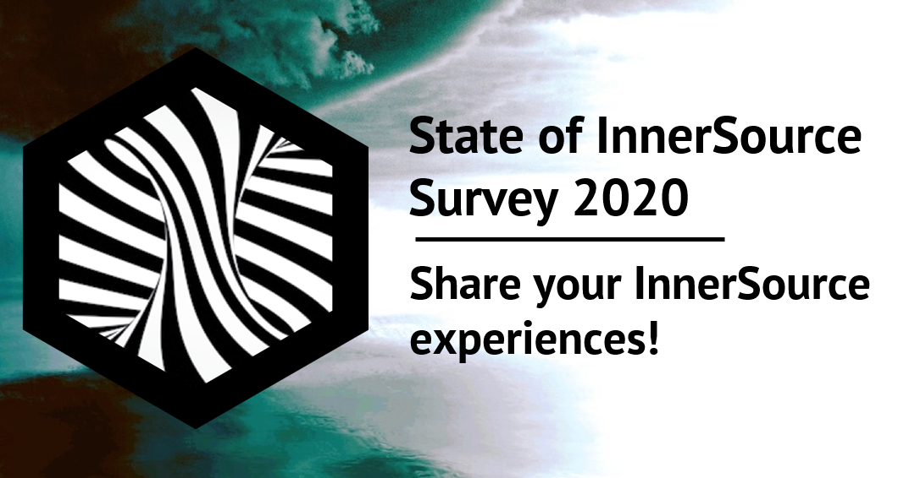

```{r setup, include=FALSE}
knitr::opts_chunk$set(echo = TRUE)
```
<style type="text/css">
.main-container {
  max-width: 1200px;
  margin-left: auto;
  margin-right: auto;
  font-size: 120%;

}
.tg  {border-collapse:collapse;border-spacing:0;}
.tg td{border-color:black;border-style:solid;border-width:1px;font-family:Arial, sans-serif;font-size:14px;
  overflow:hidden;padding:10px 5px;word-break:normal;}
.tg th{border-color:black;border-style:solid;border-width:1px;font-family:Arial, sans-serif;font-size:14px;
  font-weight:normal;overflow:hidden;padding:10px 5px;word-break:normal;}
.tg .tg-zv4m{border-color:#ffffff;text-align:left;vertical-align:bottom}
.tg .tg-mfl2{border-color:#ffffff;font-family:Verdana, Geneva, sans-serif !important;;font-size:20px;text-align:right;vertical-align:bottom}
</style>
<table class="tg" style="width:100%">
<tbody>
  <tr>
    <td class="tg-zv4m" style="width:60%"></td>
    <td class="tg-mfl2" style="width:40%"><span style="font-weight:bold"><br></br>**Tapajit Dey**</span> and <span style="font-weight:bold">**Brian Fitzgerald**</span> <br><span style="font-style:italic">*Lero --- The Irish Software Research Center*</span><br></br> We are grateful to <span style="font-weight:bold">**Clare Dillon**</span> and others from <span style="font-style:italic">*InnerSource Commons*</span> for their generous support, testers of the Pilot Survey, and every Respondent of the Survey for participating.<br><br></br></td>
  </tr>
</tbody>
</table>

```{r, include=FALSE}
library(ggplot2)
library(hrbrthemes)
library(viridis)
library(scales)
library(stringr)
library(ggthemr)
library(RColorBrewer)
myPalette <- brewer.pal(5, "Set2") 
ggthemr("grape") 
library(likert)
library(plyr)


process.mad = function(x){
  x = unlist(x)
  x = paste(x,',')
  x = unlist(strsplit(x,','))
  x = trimws(x)
  x = x[x != ""]

  return(table(x))
}
process.lik = function(x){
  return(factor(x, levels = c("Strongly Disagree", "Disagree", "Neutral", "Agree", "Strongly Agree")))
}
sub.lik = function(x){
  return(trimws(gsub("\\."," ",gsub('.*\\.\\.\\.','',x))))
}
likert.lgd = function(x){return(paste0(round(as.numeric(x)),'%'))}

sudata = read.csv("_DONOTADD_State_of_the_InnerSource_Survey 2020_Responses.csv")
sudata$Timestamp = NULL
header.map = colnames(sudata)
names(header.map) = paste0("v",seq(79))
colnames(sudata) = paste0("v",seq(79))
sudata$v79 = NULL
sudata$v78 = NULL
sudata = data.frame(lapply(sudata, trimws))
```

# **Survey Objectives**


Open Source has been a successful model for software development, with over 135M Open Source projects in existence and over 47M developers contributing to them   ([source: World of Code Dataset summary](https://bitbucket.org/swsc/overview/src/master/README.md)) across various platforms like GitHub, BitBucket, GitLab etc., and it 
continues to play an important role in the software industry, not only
because of the high quality open source software products many of their products rely on, but also
because organizations increasingly realize that open development approaches
offer many benefits, including sustainability, scaling, and quality assurance. Hence, many organizations are trying to adopt the open source
development practices within their boundaries, a practice that is known as **InnerSource**, since the term was coined by Tim O’Reilly.

In the past few years, InnerSource is gaining much attention from companies
around the globe. In 2015, the InnerSource Commons community was founded by
Danese Cooper from PayPal to help promote the practice across different organizations, and the community is growing ever since, with over 500
members in the InnerSource Commons Slack channel. This community of software
professionals are experimenting with open source development practices to
overcome the many barriers and challenges that exist in many software
organizations. 

The 2020 State of the InnerSource Survey was conducted as a checkpoint to assess how the InnerSource community is shaping up, what we have been doing right, and what aspects need improvement.

### The goal of the survey was to address three main questions -

1. What is the state of InnerSource adoption across different organizations? 
2. What factors influence the success of InnerSource adoption? 
3. What are the main obstacles for adopting InnerSource?

Since a number of studies (e.g. [Key Factors](https://dl.acm.org/doi/10.1145/2533685), [Adoption Book](https://innersourcecommons.org/resources/books/adoptinginnersource/), [Adoption Tutorial](https://ieeexplore.ieee.org/document/6809709)) already documented the Key Factors for InnerSource success in detail, we focused more on exploring the key motivations for contributors and the *obstacles*. 

# **Survey Result**
So far, we have received 41 responses in total. The demographic profiles of the respondents and their organizations are listed in the corresponding tabs under the **Demographics** Menu on the Header of this page. The detailed results for InnerSource Adoption, Success Factors, Obstacles, and our respondents' opinion on the InnerSource commons platform are listed  in the corresponding tabs under the **Detailed Results** Menu on the Header.

In Summary, most of the responses we got were from Europe and North Americas, predominantly Male, but with many different professional roles across all ages, working at companies of various sizes (2 - 400,000), mostly in Tech companies, but also from Banking & Finance.

Our respondents reported a medium progress/success with InnerSource overall, and noted the main reasons for *adoption* were **Removing Silos & Bottlenecks** and **Knowledge Sharing**, and reported a measurable progress in the latter goal. 

Creating a sense of belonging by *interacting with others with similar interests* and the *empowerment to fix defects* (The third and fourth levels of [Maslow's hierarchy of needs
](https://en.wikipedia.org/wiki/Maslow's_hierarchy_of_needs)) were the key motivations for contribution, and people mostly contributed to the projects related to their work and/or the ones with significant value to the organization. 

Time was the biggest constraint for InnerSource contributions, along with misconceptions about InnerSource among the employees and legacy incentive and governance structures that do not value InnerSource contributions as much.

People mostly find the InnerSource Commons platform useful, and we received a few ideas about further improvement (and the need of further outreach!).

### **The Good News: People are very much willing to recommend InnerSource to colleagues outside their organization, and not a single Negative response on that!!!**
```{r, echo=FALSE, fig.height=2, fig.show="hold", out.width="80%", fig.align="center", fig.width=9}
sudata$v76 = factor(sudata$v76, levels = c(1,2,3,4,5))
levels(sudata$v76) = c("Definitely not",'Probably Not','Possibly',"Probably","Definitely")
lv = sudata[,76,drop=F]
colnames(lv) = c('Likelihood of Recommending InnerSource to colleagues outside their organization')
lk = likert(lv)
plot(lk, centered=F, text.size=3.5, plot.percents =F, plot.percent.neutral=F, plot.percent.low=F, plot.percent.high=F, wrap=20) +
  geom_text(position = position_dodge2(0.75), label=unlist(lapply(lk[['results']][-1], likert.lgd))) + theme(text = element_text(size=15)) + guides(fill=guide_legend(paste0("(N=",length(na.omit(sudata$v76)),')')))
# plot(lk, centered=T, plot.percents =T, text.size=5, wrap=30, plot.percent.neutral=F, plot.percent.low=T, plot.percent.high=T) + theme(text = element_text(size=18)) + guides(fill=guide_legend(""))
```

# **Methodology**
We designed an online questionnaire targeting practitioners  of  InnerSource, which we advertised through the InnerSource Commons Slack channel and other social medias like LinkedIn & Twitter. We got 41 responses in total, including the responses to the pilot version of the survey. A few responses were cleaned manually to correct spellings, remove unrelated answers, and coining common themes.

